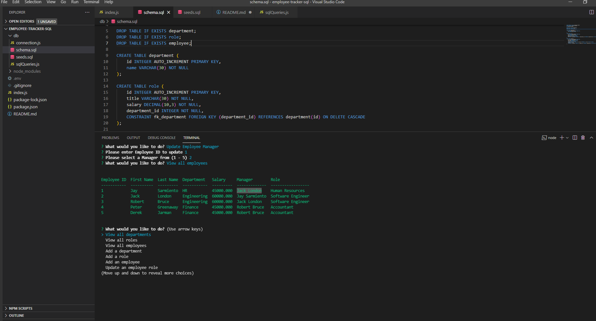

# Employee Tracker using MySQL and Inquirer

This is an employee tracker using Inquirer to get the user's input and express.js to handler routes and responses and MySQL to store the data to the database.

## Demo Video

[YouTube](https://www.youtube.com/watch?v=0IUl4Hn_eoM)

## Screenshot

